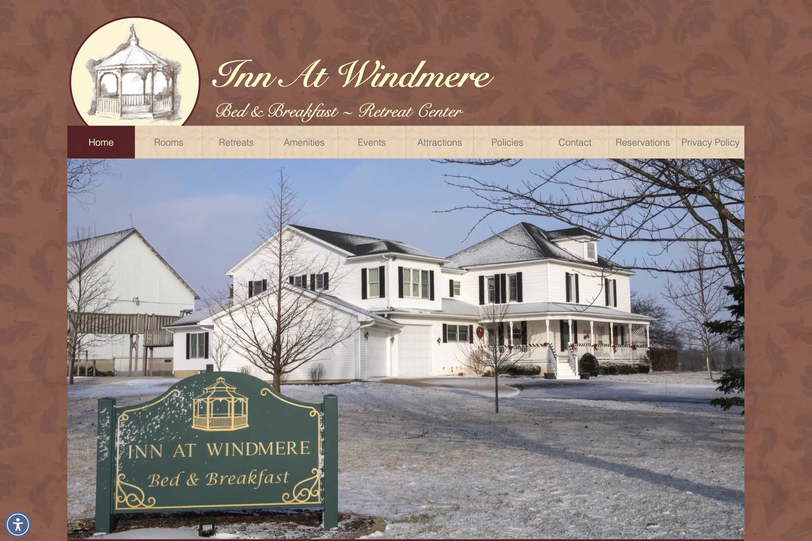
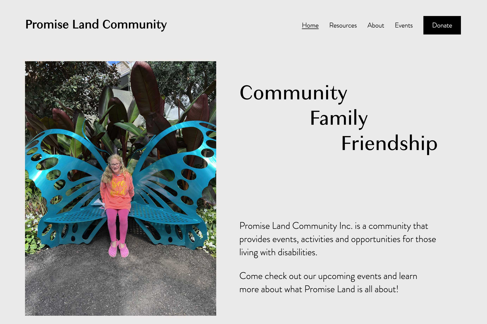
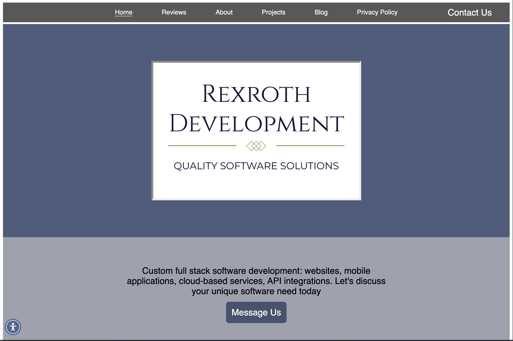

# Hi, I'm Andrew Rexroth
### Senior Full Stack Developer & Software Architect

I am an engineer with **11+ years of experience** spanning enterprise .NET architecture, embedded systems, and modern web performance. I currently run **Rexroth Development**, building premium, high-performance web solutions for businesses.

> ⚠️ **Note on Activity:** The majority of my commercial code (including my proprietary `rexroth-core-nuxt` and `rexroth-starter-nuxt` architecture) resides in **private Bitbucket repositories**. My GitHub contribution graph does not reflect my daily coding volume.

---

## 🛠 Tech Stack & Expertise

My background is unique: I combine the strict discipline of **C#/.NET Engineering** with the speed and creativity of **Modern Frontend Development**.

| Domain | Technologies |
| :--- | :--- |
| **Frontend Architecture** | **Vue.js, Nuxt 3**, React, Tailwind CSS, Contentful CMS |
| **Backend Engineering** | **C# .NET**, Node.js, Python, RESTful Services, WebSockets |
| **Cloud & DevOps** | **Azure, AWS** (Lambda, Gateway), Firebase, Docker, CI/CD |
| **Database** | SQL Server, PostgreSQL, DynamoDB, Flyway Migrations |
| **Legacy Systems** | C++, Embedded Systems, Windows Service Applications |

---

## 🔭 Current Architecture & Projects

I am currently architecting **proprietary SaaS starters** and delivering client platforms:

### 🚀 Rexroth Core & Starter (Private Architecture)
I am actively developing `rexroth-core-nuxt` and `rexroth-starter-nuxt`—a modular, production-ready architecture used to spin up high-performance client applications.
* **Focus:** Type-safe composables, automated SEO, and "Content-as-Code" layers.
* **Status:** Active Development (Bitbucket).

### 🏨 [The Inn at Windmere](https://innatwindmere.com)
*Premium Hospitality Platform*

* **Highlight:** A high-fidelity visual experience designed to drive direct bookings.
* **Performance:** Optimized asset delivery, ensuring instant load times despite heavy imagery.
* **Stack:** Vue.js, EmailJS, Eviivo API, Firebase.

### 🦋 [Promise Land Community](https://promiselandcommunity.com)
*Legacy Modernization & Content-as-Code Architecture*

* **The Engineering:** Architected a **serverless, JSON-driven event engine** that handles complex recurring schedules client-side, eliminating database overhead.
* **Stack:** Vue.js, Firebase, EmailJS.

### 💼 [Rexroth Development Agency Site](https://rexrothdev.com)
*Premium Web Design & Development*

* **Performance:** Consistently hitting < 2.2s load times with 95+ Lighthouse scores.
* **Stack:** Nuxt 3, Tailwind, Vercel.

---

## 📜 Career Highlights (From the Archives)

Before founding my agency, I led teams and built critical infrastructure in the corporate sector.

* **Lead Full Stack Developer @ Tempus Technologies:**
    * Managed a team of 4 developers with **100% on-time project delivery**.
    * Built **WebSocket cluster services** in .NET C# to handle communication between 20,000+ devices daily.
    * Reduced bug rates by **20%** through rigorous code review and mentorship.

* **Enterprise Automation & ETL Systems:**
    * **TruckMate Integration:** Engineered persistent **Windows Services** to synchronize enterprise data. Automated the extraction of datasets from third-party APIs, performed complex data transformation/normalization, and injected records directly into the **TruckMate ERP API**.
    * **Migration Scripts:** Built Python scripts to migrate **500+ HTML file structures** into Confluence, reducing migration time by 90%.
    * Developed custom **Power BI connectors** to identify operational inefficiencies, improving oversight by 10-15%

---

## 📫 Connect
* **Portfolio:** [rexrothdev.com](https://rexrothdev.com)
* **LinkedIn:** [linkedin.com/in/andrewrexroth](https://linkedin.com/in/andrewrexroth)
* **Email:** andrew@rexrothdev.com
